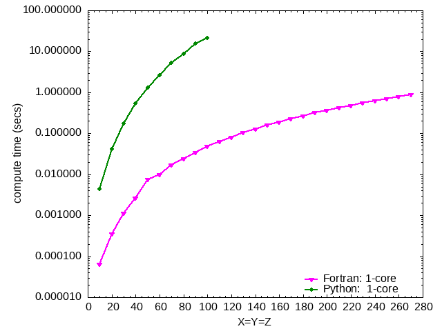
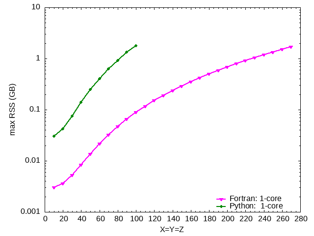

# Cubic Lattice Growth

Ilkhom Abdurakhmanov  
28/06/2024

This is the source code for growing a cubic lattice using Fortran.

## Source Code

The source code is  `create_cubic_node_opt3.f90`. It is converted from `create_node_dict.py` which is developed by 
Max Galettis and located in
the parent folder.

## Compilation

To compile the source code, use the provided `Makefile`. In your terminal, run:

```
make
```

This will execute the following commands:

```sh
ftn -Wall -O3 -c create_cubic_node_opt3.f90
ftn -Wall -O3 -o opt3 create_cubic_node_opt3.o
```

The resulting executable will be named `opt3`.

## Running the Program

You can run the program with the following command:

```sh
./opt3 <X> <Y> <Z>
```

Replace `<X>`, `<Y>`, and `<Z>` with the desired dimensions for the cubic lattice.

### Example

To grow a lattice with dimensions 2x2x2, run:

```sh
./opt3 2 2 2
```

The output will display the points and their neighbors in the lattice. For example:

```
Grew lattice with 8 points.
Box contents:
point: (0, 0, 0) neighbours: {(1, 0, 0), (0, 1, 0), (0, 0, 1)}
point: (1, 0, 0) neighbours: {(1, 1, 0), (1, 0, 1), (0, 0, 0)}
point: (0, 1, 0) neighbours: {(1, 1, 0), (0, 1, 1), (0, 0, 0)}
point: (0, 0, 1) neighbours: {(1, 0, 1), (0, 1, 1), (0, 0, 0)}
point: (1, 1, 0) neighbours: {(1, 1, 1), (0, 1, 0), (1, 0, 0)}
point: (1, 0, 1) neighbours: {(1, 1, 1), (0, 0, 1), (1, 0, 0)}
point: (0, 1, 1) neighbours: {(1, 1, 1), (0, 0, 1), (0, 1, 0)}
point: (1, 1, 1) neighbours: {(0, 1, 1), (1, 0, 1), (1, 1, 0)}
```

### Performance analysis

Comparison of compute time between Fortran and Python implementations as a function of box size.


Comparison of maximum resident set size (max RSS) memory requirements between Fortran and Python implementations as a function of box size.
Python code encounters an out-of-memory error when the box size exceeds 100x100x100.


# Neuron Random Walk: 2D Case

The Fortran source code (`case_2D.f90`) simulates a random walk of neurons in a 2D domain using a box dictionary. 
The simulation aims to model how neurons move and interact within a defined space, adhering to specific rules that govern their behavior.

## Overview

The program starts by placing `N` neurons randomly within a 2D domain of size `X x Y`. 
Each neuron then independently and randomly chooses to move in either the x or y direction according to the following rules:

1. **Movement to Unoccupied Position**:  
   If a neuron moves to an unoccupied position, it successfully relocates to that position, which is then marked as occupied.

2. **Branching on Occupied Position**:  
   If a neuron attempts to move to a position already occupied by another neuron, branching occurs. This means that the neuron can only branch when it encounters another neuron.

3. **Boundary Conditions**:  
   If a neuron tries to move out of the defined bounds of the 2D domain, it must randomly select another direction to move instead.

4. **Avoiding Self-Occupation**:  
   Neurons are prohibited from moving back into positions they have previously occupied. If a neuron encounters a situation where all potential next positions are ones it has previously occupied, that particular branch of the neuron's movement terminates.

## How to Run the Simulation

1. **Compile the Fortran Code**:  
   To compile the `case_2D.f90` source file, you can use a Fortran compiler, such as `ftn`:

   ```
   ftn -O3 -fopenmp case_2D.f90 -o exe
   ```
   

2. **Run the Executable**:  

   After compiling, you can run the executable with the following command:
   ```
   cd plotting/
   srun -n 1 -c 8 .././exe 50 50 6 1000
   ``` 
   Here the code is run with the following parameters: `X=50` and `Y=50` sets the size of the domain, 
   `N=6` is the number of neurons and `time_steps=1000` is the number of time steps.

3. **Plotting the results**:  
   
   After the computations are finished the animation which represents the neuron random walk can be generated using the following bash script:
   ```
   ./parallel_make_gif
   ```


   This is the example animation for the 6-neurons case

